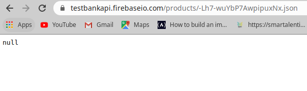

# treeconomy_test
Short test to show backend skills with Django.

This is a very simple test of HTTP requests. All requests were made through Postman. These requests have two endpoints:
1. Endpoint: https://testbankapi.firebaseio.com/products.json
2. Endpoint: https://testbankapi.firebaseio.com/products/-Lh7-wuYbP7AwpipuxNx.json

## To reproduce the environment:

- First of all, this was created under Anaconda environment with Python3.6
So, if you have Anaconda installed, you can type
`$ conda create -n treeconomy_test python=3.6`

Otherwise, if you have Python3 as default, you can do it without environment, or install Anaconda to make everything cleaner and easier.

- Second, activate the environment:
`$ source activate treeconomy_test`

- Install the necessary packages:
`$ pip install django djangorestframework requests`

- Clone the repository to execute the code:
*In the folder of your preference:*
`$ git clone https://github.com/warango4/treeconomy_test.git`

## To execute:
There are some migrations that have to be applied to begin:
`$ cd treeconomy_test`
`$ python manage.py makemigrations`
`$ python manage.py migrate`

Next, we run the server to check everything is fine:
`$ python manage.py runserver`

If it goes well, something like this should appear in your terminal:

And when you access to `http://127.0.0.1:8000/`, you are going to find a simple view like this:

`http://127.0.0.1:8000/desserts/` shows what you have in the SQLite database and it allows you to insert new records. 

The most important links are `http://127.0.0.1:8000/get_post/` and `http://127.0.0.1:8000/put_delete/`.

## Requests

### GET and POST

In the `/get_post` view, you are going to find a list showing the products from the 1st endpoint and, at the end, there is going to be a value for the total sum of all the products prices. 

To post a new product, you open Postman and insert a new body, as raw or as form-data, however you prefer, and send the request.
An example of how should be the body is given below:

**IMPORTANT:** you have to make sure you add the `application/json` to your headers as follows:

And, as you can see in the image above, the request returned a 200 code which means it could insert in the endpoint. 
Also, you can check in your terminal the requests the api has had.

### PUT and DELETE

The `/put_delete` view does not render an html page. So far, it just accepts requests from Postman, just as the other view, even though the other one does render what returned from the GET request.

To put a new product, you follow the same process as the POST request.
Before PUT, in the second endpoint, what you see is this:

The request you make from Postman is:

And after making this request what you get is:

To delete in the endpoint the request is easier because it does not have to have a body, so in Postman what you do is:

And after doing it and getting the 200 code, you go to the endpoint and see a null message, because everything was erased. 

You can simply PUT a new product and it will have data again.

## Tree
There are 5 folders in this project.
- **consume_restful_api**, which has the settings and the urls. In `settings.py` there is the restframework app installed and also main_app.
- **documents**, which has this test's theoretical questions and their respective answers.
- **images**, contains all the images posted in this README.
- **main_app**, which has:
    * `models.py`: this file creates the model of the database.
    * `serializer.py`: serializes the model(s) so the views can manage them.
    * `services.py`: it is an abstraction layer where the HTTP request methods are implemented so the view call this file and its functions to avoid making the call directly from the view.
    * `urls.py`: there are the URL patterns to access to the different endpoints of the API.
    * `views.py`: creates the endpoints of the API and calls the `services.py` to do and return requests.
    - **tests**: it has a list of tests for further automated QA and integration. 
- **templates**, contains the HTML files that renderize the obtained products through the GET request. It shows the records in a list as Product Name - Description - Value. At the end, shows the sum of the prices of all the products. 

The file `manage.py`, as its name says, manages all the commands to the API (like runserver, makemigrations, migrate).
And last but not least, the file `db.sqlite3`, where the models are mapped and, through ORM in Django, are manage with CRUD methods.
